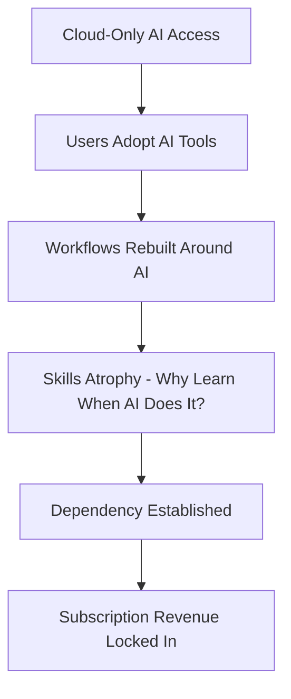
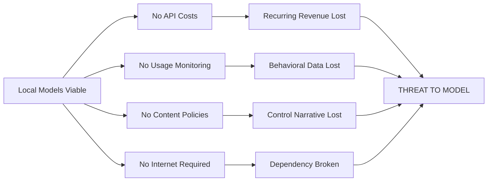
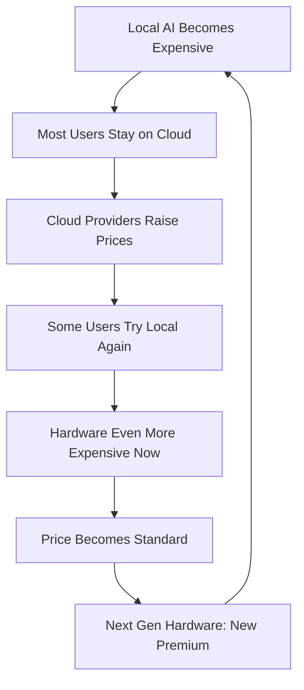

# AI Hardware Control Timeline (2021-2025)
## The Localization Threat and Control Response

---

## Executive Summary

Between 2021 and 2025, a distinct pattern emerged in the AI industry. As consumer hardware advanced to the point where local AI inference became viable, threatening centralized cloud-based control, hardware access became systematically constrained through pricing manipulation and artificial scarcity.

**The Pattern**: When software cannot be controlled (humans create what they need), control the hardware layer instead.

---

## Phase 1: Dependency Creation (2021-2022)

### The AI Awakening

**2021: Foundation Models Go Public**
- GPT-3 released via API (June 2020, mainstream adoption 2021)
- DALL-E introduced (January 2021)
- GitHub Copilot launched (June 2021)

**What Happened**: AI capabilities that previously required research lab infrastructure became accessible through simple API calls.

### Dependency Mechanisms

#### Key Dependency Drivers

1. **Zero Local Compute Required**
   - No need for expensive GPUs
   - Works on any device with internet
   - Democratization narrative

2. **Convenience Layer**
   - Simple web interfaces
   - No technical knowledge needed
   - Instant results

3. **Free/Low-Cost Entry**
   - Free tiers for individuals
   - Low initial API costs
   - "Experimenting encouraged"

4. **Network Effects**
   - Social media demos go viral
   - "Everyone is using AI"
   - FOMO drives adoption

### The Lock-In

**By End of 2022**:
- Businesses rebuilding workflows around AI APIs
- Developers using AI coding assistants as standard
- Students using AI for research and writing
- Creators using AI for art and content

**Critical Shift**: AI moved from "cool experiment" to "expected tool" in ~18 months.

---

## Phase 2: The Localization Threat (2023-2024)

### Hardware Advancement

**What Changed**: Consumer GPUs became powerful enough to run useful models locally.

#### Key Milestones

**2023**:
- **Llama Leaked** (February): 7B-65B parameter models escape into the wild
- **Llama 2 Released** (July): Meta releases openly
- **GPU Market**: RTX 4090 (24GB), RTX 4080 dominate high-end
- **Quantization Breakthroughs**: GGML format makes 13B models run on 16GB VRAM

**Early 2024**:
- **Llama 3** (April): Competitive with GPT-3.5
- **Local UI Tools**: LM Studio, Ollama, Text Generation WebUI mature
- **Consumer Hardware**: RTX 4070 Ti Super (16GB) at $800, RTX 4060 Ti (16GB) at $500
- **M-Series Macs**: Unified memory allows large context windows

### The Threat to Centralized Control

#### What Local AI Enabled

1. **Financial Independence**: One-time hardware cost vs. perpetual subscriptions
2. **Privacy**: No data sent to external servers
3. **Uncensored Use**: No content moderation
4. **Offline Capability**: No internet dependency
5. **Unlimited Usage**: No rate limits or quotas

### The Realization

**Key Insight**: "Software can't be controlled - we humans create if we need something. So they had hardware in control and increased the cost."

Once models leak (Llama, Mistral, etc.), they can't be put back. Open source community will optimize, quantize, and fine-tune. **The only controllable choke point is hardware.**

---

## Phase 3: Control Response (Late 2024-2025)

### Hardware Gatekeeping

#### Strategy 1: Pricing Manipulation

**GPU Price Trends (Retail)**:

| Model | VRAM | 2023 Launch | Mid-2024 | Late 2024 | 2025 |
|-------|------|-------------|----------|-----------|------|
| RTX 4090 | 24GB | $1,599 | $1,799 | $1,999+ | Discontinued early |
| RTX 4080 Super | 16GB | $999 | $1,099 | $1,199 | $1,299 |
| RTX 4070 Ti Super | 16GB | $799 | $849 | $899 | $949 |
| RTX 5090 | 32GB | - | - | - | $2,499 (Jan 2025) |
| RTX 5080 | 16GB | - | - | - | $1,499 (Jan 2025) |

**Pattern**: 
- Increase prices gradually
- Discontinue best value-per-VRAM options
- New generation: massive price jump for equivalent capability

#### Strategy 2: Artificial Scarcity

**Observed Tactics**:
1. **Limited Production Runs**: High-VRAM cards "sold out" perpetually
2. **Regional Restrictions**: Certain models unavailable in specific markets
3. **AIB Tax**: Board partners forced to price above MSRP
4. **Crypto Excuse**: Blame scalpers/miners despite crypto downturn

#### Strategy 3: VRAM Segmentation

**The 8GB Wall**:
- Entry GPUs locked at 8GB (barely useful for local AI)
- 12GB tier expensive and limited
- 16GB+ tier priced as "professional"

**Example**: RTX 5060 Ti - successor to 4060 Ti 16GB
- Expected: 16GB standard at similar price
- Reality: 8GB base model, 16GB version $200+ premium or unavailable

### Software-Layer Discouragement

While hardware is primary control point, complementary measures:

1. **Convenience Moat**: Cloud AI adds features (web search, image generation, voice) harder to replicate locally
2. **Integration Lock-In**: APIs embedded in tools (Notion, Cursor, Adobe)
3. **Complexity Narrative**: "Local is too hard for normal users"
4. **Legal Pressure**: Unclear licensing, potential liability for model use

---

## Phase 4: Standardization (2025 Onward)

### The New Baseline

**What's Being Normalized**:

1. **$1,500+ for Useful Local AI**: 16GB+ VRAM at "prosumer" pricing
2. **Subscription Default**: Cloud AI as standard, local as "enthusiast" option
3. **Hardware Churn**: New model generations quickly "obsolete" previous for AI
4. **Segmented Market**: "AI PCs" with NPUs (insufficient) vs. actual GPU compute

### The Cycle Continues

**Next Need Being Created**: Edge AI / NPU narrative
- "You need an AI PC with dedicated NPU"
- Reality: NPUs insufficient for real models
- Effect: Another hardware refresh cycle

---

## The Tolerance Margin: Why Local AI Still Exists

### Controlled Opposition

Local AI is **not** completely blocked because:

1. **Innovation Harvesting**: 
   - Open source community optimizes models
   - Techniques (quantization, LoRA) developed for free
   - Cloud providers adopt these innovations

2. **Legitimacy Maintenance**:
   - "See, you can run it locally if you want"
   - Appearance of openness
   - Prevents regulatory backlash

3. **Market Segmentation**:
   - Enthusiasts pay premium for hardware (profitable)
   - Creates advocacy class defending the ecosystem
   - "Prosumer" tier justifies enterprise pricing

4. **Safety Valve**:
   - Prevents total revolt
   - Those who care most get outlet
   - Too small to threaten core business

### The Viable Resistance

**Current Reality** (2025):
- Local AI is possible but expensive
- Requires technical knowledge
- Limited to enthusiasts and professionals
- ~5-10% of AI users vs. 90%+ on cloud

**This ratio is intentional** - enough to harvest innovation and prevent revolt, small enough to maintain control over the majority.

---

## Key Takeaways

### The Pattern Applied to AI

| Control Stage | AI Implementation (2021-2025) |
|---------------|-------------------------------|
| **Create Need** | Foundation models show AI capability, use cases proliferate |
| **Make Hard** | Local compute "insufficient" for quality results |
| **Convenience** | API access, simple interfaces, free tiers |
| **Monetize** | Subscription models, usage-based pricing |
| **Monitor** | Every prompt logged, usage patterns analyzed |
| **Mandate** | Industries adopt "AI-first", job requirements include AI tools |
| **Control** | When local becomes viable, make hardware scarce/expensive |
| **Standard** | Normalize cloud dependency and high hardware costs |

### Why Hardware?

**Software is Uncontrollable**:
- Once leaked, can't be recalled
- Open source community will fork, modify, distribute
- Encryption and DRM ineffective at inference time
- Humans will create tools if they need them

**Hardware is the Choke Point**:
- Manufacturing requires massive capital
- Supply chains controlled by few companies
- Artificial scarcity easily created
- Pricing manipulated through "market forces"
- Regulatory capture easier (export controls, tariffs)

### The Dependency Reimposed

Even as software broke free (Llama, Mistral, Qwen), dependency was maintained by controlling the compute substrate. The cycle adapted:

**Old Model**: Control the model itself (GPT-3.5/4 API-only)  
**New Model**: Control the hardware to run models (GPU scarcity + pricing)

---

## Conclusion

The 2021-2025 AI timeline demonstrates adaptive control:

1. **2021-22**: Create dependency on cloud AI
2. **2023-24**: When local hardware threatens control, pivot strategy
3. **2024-25**: Control hardware layer since software can't be controlled
4. **2025+**: Standardize new price baseline, create next need (NPUs, edge AI)

**The Core Mechanic**: When one control point fails (leaked models), shift to a deeper layer (hardware access). Maintain just enough openness to prevent revolt and harvest innovation, but make alternatives expensive enough that most users stay dependent.

This is the control-through-dependency pattern applied in real-time to a rapidly evolving technology landscape.

---

*Timeline based on observed market trends, pricing data, and product releases. The interpretation of intent is analytical, not conspiratorial - the pattern exists whether coordinated or emergent.*
