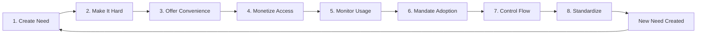

# The Control-Through-Dependency Pattern
## A Cross-Domain Analysis of Modern Power Structures

---

## Abstract

This document analyzes a recurring pattern of control that operates not through direct force, but through the creation and management of dependencies. Unlike traditional hierarchies where power is overt, this model establishes control by becoming indispensable to the target population's ability to function.

The pattern works on **mass scale, not individual rulers** - it requires volume to function effectively.

---

## The 8-Step Control Cycle

### Step-by-Step Breakdown

#### 1. **Create Need**
- Introduce a capability that doesn't exist or consolidate fragmented options
- Make it visible, desirable, or solve a real pain point
- Examples: Cloud storage, ride-sharing, AI assistants

#### 2. **Make It Hard (Without the Solution)**
- Increase friction in alternative methods
- Deprecate competing standards
- Create artificial scarcity
- Examples: Removing headphone jacks, deprecating local file systems

#### 3. **Offer Convenient Solution**
- Provide a streamlined, "just works" experience
- Lower barrier to entry initially
- Make switching costs appear minimal
- Examples: Free tiers, one-click setups, seamless integrations

#### 4. **Monetize Access**
- Introduce pricing once dependency is established
- Tier features to encourage upsells
- Make basic functionality paid over time
- Examples: SaaS subscriptions replacing one-time purchases

#### 5. **Monitor the Process**
- Track usage patterns, engagement metrics
- Collect behavioral data
- Identify power users and edge cases
- Examples: Telemetry, analytics, "improving your experience"

#### 6. **Make It Compulsory**
- Create scenarios where opting out is impractical
- Establish network effects (everyone else uses it)
- Integrate into critical workflows
- Examples: "Industry standard" tools, required for employment

#### 7. **Control the Flow**
- Regulate access, features, pricing
- Gate capabilities behind approvals or subscriptions
- Create dependency on provider's infrastructure
- Examples: API rate limits, feature flags, regional restrictions

#### 8. **Standardize**
- Normalize the new baseline
- Make it "just how things are done"
- New generation doesn't remember alternatives
- Examples: Subscription models, always-online requirements

#### New Need Emerges
The cycle repeats as the standardized solution creates new friction points or opportunities.

---

## Tolerance Margins: The Safety Valve

A critical component of this system is **controlled dissent**:

> "Safe margins and tolerance - even in engineering we can't do things accurately, so we tolerate some noise. Similarly, hackers and others - if they oppose too much, it makes everyone revolt. So they allow it, and also exploit them for their greed."

### Why Allow Resistance?

1. **Pressure Release**: Prevents complete revolt by allowing limited circumvention
2. **Innovation Harvesting**: Hackers and tinkerers develop solutions that can be co-opted
3. **Legitimacy**: Appearance of openness/freedom maintains consent
4. **Identification**: Those who resist become visible and trackable

### Examples
- **Jailbreaking**: Tolerated until it threatens core revenue, then selectively enforced
- **Open Source**: Embraced when it provides free labor, restricted when it competes
- **Right to Repair**: Allowed in limited scope while core control remains

---

## Domain Analysis

### 1. Technology Sector

#### Cloud Computing
| Stage | Implementation |
|-------|---------------|
| **Create Need** | "Access files anywhere, collaborate in real-time" |
| **Make Hard** | Local storage becomes "insufficient", sync tools disappear |
| **Convenience** | Dropbox, Google Drive - free tiers, automatic backup |
| **Monetize** | Storage limits, feature paywalls, business tiers |
| **Monitor** | File access patterns, sharing behavior, content scanning |
| **Mandate** | Remote work "requires" cloud collaboration |
| **Control** | Can revoke access, change pricing, scan content |
| **Standard** | Local-only storage seen as "risky" or "old-fashioned" |

#### Mobile Ecosystems
| Stage | Implementation |
|-------|---------------|
| **Create Need** | App stores for "safe, curated" software |
| **Make Hard** | Sideloading discouraged/blocked, warnings for unknowns |
| **Convenience** | One-tap installs, automatic updates, family sharing |
| **Monetize** | 30% cut of all transactions, subscription mandates |
| **Monitor** | Download history, usage time, in-app behavior |
| **Mandate** | Developers must use approved payment systems |
| **Control** | App rejections, guideline changes, account bans |
| **Standard** | Direct downloads seen as "dangerous" |

#### AI Tools (Current Phase)
| Stage | Implementation |
|-------|---------------|
| **Create Need** | "AI makes you 10x more productive" |
| **Make Hard** | Local compute "too slow", models "too complex" |
| **Convenience** | ChatGPT, Midjourney - simple interfaces, instant results |
| **Monetize** | Usage caps, premium tiers, API pricing |
| **Monitor** | Every prompt logged, usage patterns analyzed |
| **Mandate** | "AI-first" companies require use for employment |
| **Control** | Content policies, model access, region locks |
| **Standard** | *In progress - resistance forming around local AI* |

---

### 2. Infrastructure

#### Automobiles
| Stage | Implementation |
|-------|---------------|
| **Create Need** | Personal transportation, freedom of movement |
| **Make Hard** | Public transit defunded, cities designed for cars |
| **Convenience** | Mass production, financing options, highways |
| **Monetize** | Car payments, insurance mandates, fuel |
| **Monitor** | License plates, tolls, increasingly vehicle telemetry |
| **Mandate** | Jobs outside walking distance, suburban sprawl |
| **Control** | Emissions standards, safety inspections, connected cars |
| **Standard** | Car ownership seen as necessity, not luxury |

#### Internet Access
| Stage | Implementation |
|-------|---------------|
| **Create Need** | Information access, communication, commerce |
| **Make Hard** | Physical infrastructure expensive, alternatives slow |
| **Convenience** | ISP bundles, wifi everywhere, mobile data |
| **Monetize** | Monthly subscriptions, data caps, speed tiers |
| **Monitor** | Browsing history, traffic analysis, DNS logs |
| **Mandate** | Employment, education, government services online |
| **Control** | Bandwidth throttling, content blocking, net neutrality battles |
| **Standard** | Internet access now considered basic utility |

---

### 3. Finance

#### Digital Payments
| Stage | Implementation |
|-------|---------------|
| **Create Need** | "Cashless convenience, rewards programs" |
| **Make Hard** | ATMs reduced, cash-only stigmatized, change shortages |
| **Convenience** | Tap-to-pay, instant transfers, budgeting apps |
| **Monetize** | Transaction fees, interchange rates, premium cards |
| **Monitor** | Every purchase tracked, spending patterns analyzed |
| **Mandate** | Online shopping requires cards, some vendors cashless |
| **Control** | Account freezes, transaction blocks, spending limits |
| **Standard** | Cash users seen as suspicious or inconvenient |

#### Banking Apps
| Stage | Implementation |
|-------|---------------|
| **Create Need** | "Bank from anywhere, instant transfers" |
| **Make Hard** | Branch closures, limited teller hours, fees for in-person |
| **Convenience** | Mobile check deposit, bill pay, account alerts |
| **Monetize** | Overdraft fees, minimum balances, premium features |
| **Monitor** | Login patterns, transaction categorization, location data |
| **Mandate** | Direct deposit required for jobs, government benefits |
| **Control** | App-based fraud detection, account locks, feature gates |
| **Standard** | Physical banking seen as inefficient |

---

## The "Sheep" Metaphor Clarified

> "Sheep in sense not no-brain, but slaves to needs. Can we live without a bike or any transportation, mobile? Not directly or indirectly - thus they give that, we keep convenience."

### Not Stupidity - Dependency

The metaphor is **not** about intelligence, but about:

1. **Constructed Needs**: Systems designed so opting out creates hardship
2. **Distributed Control**: No single "king" but many providers we depend on
3. **Rational Choice**: Given the system, participation is often the logical choice
4. **Invisible Coercion**: Feels like freedom (choosing providers) but choice happens within controlled bounds

### Modern "Rulers" Are Providers

Power has shifted from:
- **Traditional**: Kings, governments (direct force)
- **Modern**: Providers of essential infrastructure (indirect necessity)

You can't easily opt out of:
- Internet connectivity
- Financial systems
- Transportation networks
- Communication platforms
- Computing infrastructure

---

## The Question: To Control or Be Controlled?

The analysis presents a challenge:

**Individual Level**: 
- Full autonomy is increasingly impractical
- Each dependency compounds others
- Resistance requires significant sacrifice

**Collective Level**:
- Systems require mass participation to function
- Organized resistance faces coordination problems
- Alternative systems struggle to reach critical mass

**The Core Dilemma**:
> In a world of constructed dependencies, how much autonomy is actually achievable? Is the goal complete independence (likely impossible) or strategic dependency management (choosing which systems to engage with)?

---

## Conclusion

The control-through-dependency pattern represents a shift from overt power to infrastructural power. It operates by:

1. Creating genuine utility (the services often do solve real problems)
2. Establishing dependency through convenience and network effects
3. Monetizing and monitoring once switching costs are high
4. Standardizing the new baseline for the next generation

This pattern appears across technology, infrastructure, and finance - suggesting a consistent logic to modern power structures.

**The pattern works because it doesn't feel like control** - it feels like convenience, progress, and individual choice. The coercion is in the system design, not the individual interaction.

---

*This analysis is descriptive, not prescriptive. It aims to make visible a pattern that operates most effectively when it remains invisible.*
