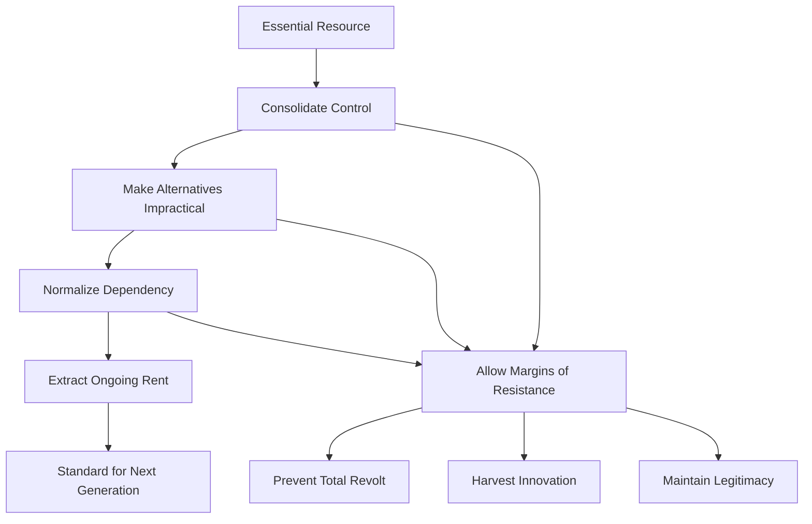

# Historical Parallels: Control-Through-Dependency Across Eras
## Comparative Case Studies

---

## Introduction

The control-through-dependency pattern appears repeatedly across different historical periods and industries. While technology and context change, the underlying mechanics remain consistent:

1. Create or consolidate access to something essential
2. Make alternatives difficult or impossible
3. Monetize the dependency
4. Monitor and control usage
5. Standardize the new baseline

This document examines four major historical cases, then compares them to the modern AI/tech pattern.

---

## Case Study 1: Land Enclosure (15th-19th Century)

### Historical Context

**The Commons System**:
- Agricultural land held collectively by communities
- Villagers had rights to graze animals, gather wood, farm strips
- Decentralized subsistence economy
- Low productivity but high autonomy

### The Enclosure Movement

#### Phase 1: Create Need (Efficiency Narrative)
**15th-16th Century**:
- Wool trade creates demand for consolidated sheep farming
- Narrative: "Scientific agriculture requires large, managed plots"
- Claim: Commons are inefficient, tragedy-prone

#### Phase 2: Make It Hard (Legal Barriers)
**16th-18th Century**:
- Private Enclosure Acts passed by Parliament
- Legal frameworks favor landowners over commoners
- Physical fencing of previously open land
- Traditional rights become illegal trespassing

#### Phase 3: Offer "Convenience" (Wage Labor)
**17th-18th Century**:
- Factory jobs in cities presented as alternative
- "Freedom" to sell labor instead of working land
- Urban migration framed as opportunity, not displacement

#### Phase 4: Monetize
**18th-19th Century**:
- Rent extracted from tenant farmers
- Wage labor in factories (less compensation than subsistence farming)
- Food purchased instead of grown

#### Phase 5: Monitor & Control
**18th-19th Century**:
- Vagrancy laws criminalize unemployment
- Poorhouses and workhouses for those who can't participate
- Factory discipline and time-keeping imposed

#### Phase 6: Standardize
**19th Century+**:
- Wage labor becomes normal
- Land ownership concentrated among elite
- Subsistence farming seen as backwards
- New generation doesn't know the commons system

### Tolerance Margin

**What Was Allowed**:
- Small cottage industries
- Urban gardens and allotments (tiny compared to commons)
- Emigration to colonies (outlet for displaced)

**Why**: Provided escape valve, generated colonial labor, prevented total revolt

### Parallels to AI/Tech

| Enclosure Movement | Modern Tech/AI |
|-------------------|----------------|
| **Commons**: Shared land access | **Commons**: Open protocols, local compute |
| **Enclosure**: Private property laws | **Enclosure**: Proprietary platforms, API gates |
| **Displacement**: Farmers → wage workers | **Displacement**: Users → subscribers |
| **Efficiency Claim**: Scientific agriculture | **Efficiency Claim**: Cloud scalability, AI productivity |
| **New Normal**: Land ownership → rent/wages | **New Normal**: Software ownership → subscriptions |

---

## Case Study 2: Oil Industry Consolidation (1860s-1920s)

### The Early Days: Decentralized Chaos

**1860s-1870s**:
- Oil boom in Pennsylvania
- Hundreds of small producers, refiners
- Wildcat competition, volatile prices
- Regional markets

### Rockefeller and Standard Oil

#### Phase 1: Create Need (Infrastructure Integration)
**1870s**:
- Oil lighting superior to whale oil, candles
- Kerosene demand grows
- Need for reliable supply and quality

#### Phase 2: Make It Hard (Control Chokepoints)
**1870s-1880s**:
- Standard Oil negotiates secret railroad rebates
- Competitors pay more to ship oil
- Can't compete on price even with better wells
- Buy out or bankrupt competitors

**Key Tactic**: Don't control the oil wells (too many) - **control the railroads and refineries** (bottlenecks).

#### Phase 3: Offer Convenience  (Vertical Integration)
**1880s-1890s**:
- Standard Oil offers "fair" buyout prices
- Promises stability and distribution
- Small producers get immediate cash
- "Join us or go bankrupt"

#### Phase 4: Monetize (Market Control)
**1890s-1900s**:
- Standard Oil controls ~90% of US refining
- Sets prices for producers and consumers
- Massive profit margins
- Expansion into international markets

#### Phase 5: Monitor & Control
**1900s-1910s**:
- Track all competitors
- Predatory pricing to kill new entrants
- Political influence to shape regulations
- Information asymmetry maintained

#### Phase 6: Standardize (The New Normal)
**1910s-1920s**:
- Integrated oil companies become industry model
- Small independent producers marginalized
- Vertical integration seen as "natural"
- Even post-breakup (1911), Standard successors dominate

### Tolerance Margin

**What Was Allowed**:
- Independent producers in hard-to-reach areas
- Small regional distributors
- Alternative fuels (marginal - electric, coal gas)

**Why**: Too costly to completely eliminate, provided competition veneer, absorbed local market risks

### Parallels to AI/Tech

| Oil Industry | Modern Tech/AI |
|--------------|----------------|
| **Bottleneck**: Railroads/refineries | **Bottleneck**: Cloud infrastructure, app stores |
| **Consolidation**: Standard Oil | **Consolidation**: FAANG, OpenAI |
| **Vertical Integration**: Well → refinery → distribution | **Vertical Integration**: Hardware → software → distribution |
| **Pricing Power**: Set kerosene prices | **Pricing Power**: Set API rates, subscription tiers |
| **Buyout Strategy**: Acquire competitors | **Buyout Strategy**: Acqui-hire, shut down threats |

**AI Hardware Specific**: 
- Don't control the models (leaked/open) 
- **Control the GPUs** (modern parallel to railroads)

---

## Case Study 3: Telecommunications (1876-2000s)

### The Bell System Monopoly

#### Phase 1: Create Need (Communication Revolution)
**1876-1890s**:
- Telephone invented (1876)
- Instant voice communication revolutionary
- Business and personal demand grows

#### Phase 2: Make It Hard (Patent Control)
**1880s-1894**:
- Bell holds telephone patents
- Legal enforcement against competitors
- Network effects: value increases with users

#### Phase 3: Offer Convenience (Universal Service)
**1894-1910s**:
- Patents expire (1894) → competition emerges
- AT&T strategy: "One Policy, One System, Universal Service"
- Interconnection: only Bell phones work on Bell network

#### Phase 4: Monetize (Regulated Monopoly)
**1913-1984**:
- AT&T becomes legal monopoly (Kingsbury Commitment, 1913)
- Price regulation in exchange for universal service mandate
- Long-distance premiums, equipment rental fees
- Guaranteed profit margins

#### Phase 5: Monitor & Control
**1920s-1980s**:
- Control phone equipment (rental only)
- Monitor all voice traffic (CALEA later formalizes)
- Suppress competing technologies (early mobile, data)
- Vertical integration: Western Electric manufactures all equipment

#### Phase 6: Standardize (The Normal)
**1950s-1980s**:
- Landline in every home expected
- "Ma Bell" as benevolent infrastructure provider
- Competition unthinkable
- Equipment standardization (rotary, touch-tone on Bell schedule)

### The Breakup and Adaptation

**1984**: AT&T broken into regional Bells

**What Happened**: Dependency shifted but didn't vanish
- Local monopolies (Baby Bells) instead of one national
- Long-distance competition (illusion of choice)
- Mobile era: consolidation reverses (mergers recreate scale)
- **2024**: Essentially 3 carriers (Verizon, AT&T, T-Mobile)

### Tolerance Margin

**What Was Allowed**:
- Independent phone companies in rural areas (uneconomical for Bell)
- Ham radio (hobbyist, non-commercial)
- Post-breakup: long-distance choice (still using Bell infrastructure)

**Why**: Regulatory appeasement, covered unprofitable areas, maintained innovation outlet

### Parallels to AI/Tech

| Telecommunications | Modern Tech/AI |
|--------------------|----------------|
| **Network Effects**: Phone value = # of users | **Network Effects**: Platform value = # of users |
| **Equipment Rental**: Bell lease model | **Equipment Rental**: SaaS subscriptions |
| **Interconnection Control**: Bell-only networks | **Interconnection Control**: API ecosystems, walled gardens |
| **Vertical Integration**: AT&T + Western Electric | **Vertical Integration**: Apple hardware + software, Google search + ads |
| **Breakup**: Baby Bells | **Breakup**: Potential Big Tech antitrust (not yet) |
| **Re-consolidation**: Mergers recreate scale | **Re-consolidation**: Ongoing (Instagram→FB, WhatsApp→FB, etc.) |

---

## Case Study 4: Cloud Computing (2006-Present)

### The Pre-Cloud Era

**1990s-Early 2000s**:
- Companies run own servers
- Upfront capital expense
- IT staff for maintenance
- Full control but high complexity

### Amazon Web Services Revolution

#### Phase 1: Create Need (Elastic Infrastructure)
**2006-2008**:
- AWS launches (S3, EC2)
- "Only pay for what you use"
- Eliminate capital expense
- Scale instantly

#### Phase 2: Make It Hard (Complexity Shift)
**2008-2012**:
- Cloud-native architectures emerge
- Services designed for cloud (serverless, managed DBs)
- On-prem requires sophisticated DevOps to match
- "Undifferentiated heavy lifting" narrative

#### Phase 3: Offer Convenience (Managed Services)
**2012-2016**:
- Higher-level abstractions (Lambda, RDS, etc.)
- One click deployments
- Free tiers for startups
- GitHub Student packs with cloud credits

#### Phase 4: Monetize (Lock-In Economics)
**2014-Present**:
- Data egress fees (leave cloud = pay per GB)
- Service interdependencies (hard to migrate one service)
- Proprietary APIs (vendor lock-in)
- Price increases after dependency established

#### Phase 5: Monitor & Control
**2016-Present**:
- Every API call logged
- Usage metrics analyzed
- Billing tied to specific features
- Account suspensions for ToS violations (sometimes opaque)

#### Phase 6: Standardize (Cloud-First Culture)
**2018-Present**:
- "Cloud-native" as job requirement
- Startups default to AWS/GCP/Azure
- On-prem seen as legacy
- Kubernetes (initially liberation) becomes complex enough that managed offerings win (EKS, GKE)

### Current State

**The Illusion of Choice**:
- Three major providers (AWS, Azure, GCP)
- Pricing roughly equivalent (oligopoly)
- Multi-cloud: marketed but rarely practical
- Repatriation possible but expensive

### Tolerance Margin

**What's Allowed**:
- Self-hosted for hobbyists (small scale)
- Hybrid cloud (most data stays in cloud)
- Indie hosting providers (Hetzner, DigitalOcean) for price-sensitive

**Why**: Handles unprofitable small users, regulatory compliance (data sovereignty), innovation source (later acquired or copied)

### Parallels to AI/Tech (Most Direct)

Cloud computing IS the modern tech pattern - AI is following the same playbook:

| Cloud Computing | AI Services |
|-----------------|-------------|
| **Sell**: "Eliminate server management" | **Sell**: "Eliminate model training" |
| **Reality**: Trade control for convenience | **Reality**: Trade data/privacy for capability |
| **Lock-In**: Data egress fees | **Lock-In**: Prompt history, fine-tuned models |
| **Margin**: Run own servers if you want (expensive) | **Margin**: Run own models if you want (expensive GPUs) |
| **Pricing**: Increase after dependency | **Pricing**: Increase API costs, reduce free tiers |

---

## Cross-Case Pattern Recognition

### Common Elements Across All Cases

### The Core Mechanics

| Element | Land Enclosure | Oil | Telecom | Cloud | AI/Hardware |
|---------|----------------|-----|---------|-------|-------------|
| **Essential Resource** | Agricultural land | Energy | Communication | Compute | AI capability |
| **Consolidation Method** | Private property laws | Railroad deals | Patents + network effects | Infrastructure scale | GPU scarcity |
| **Alternative Made Hard** | Subsistence farming criminalized | Must use railroads | Must interconnect | DIY ops complexity | Hardware expensive |
| **Monetization** | Rent, wages | Oil prices | Service fees | Usage-based pricing | Subscriptions, GPU premiums |
| **Monitoring** | Vagrancy laws | Market intelligence | Call records | API logs | Prompt logging |
| **Standardization** | Wage labor normal | Integrated oil cos. | Universal service | Cloud-first | AI subscription default |
| **Tolerance Margin** | Small gardens, emigration | Independent producers | Rural independents | Self-hosting | Local AI hobbyists |
| **Timescale** | ~300 years | ~60 years | ~100+ years | ~18 years | ~4 years (so far) |

### Key Insights

1. **Control Shifts to Bottlenecks**
   - Not the abundant resource (land, oil wells, cloud servers, AI models)
   - But the scarce chokepoint (legal access, railroads, networks, infrastructure, GPUs)

2. **Dependency Before Monetization**
   - Always establish need first
   - Make switching prohibitively expensive
   - Then extract rent

3. **Generational Normalization**
   - Each generation accepts current system as baseline
   - Previous autonomy forgotten or seen as primitive
   - "How things have always been"

4. **Tolerance as Safety Valve**
   - Complete lockdown creates revolt
   - Margins allow pressure release
   - Hobbyists innovate, then get co-opted
   - Maintains illusion of freedom

5. **Acceleration**
   - Earlier cycles took centuries/decades
   - Modern cycles (cloud, AI) take years
   - Technology enables faster consolidation
   - Resistance has less time to organize

---

## Unique Aspects of AI/Tech

### What's Different This Time

1. **Digital Replication**
   - Land can't be copied: once enclosed, it's gone
   - Software CAN be copied: models leak, code forks
   - Control must shift to hardware layer (non-copyable)

2. **Global Scale**
   - Previous cases were regional (land) or national (oil, telecom)
   - Tech/AI operates globally from day one
   - Harder to regulate, easier to impose universal standards

3. **Speed of Adoption**
   - Telephone took 70 years to reach saturation
   - Cloud computing took ~15 years
   - ChatGPT took ~2 months to hit 100M users
   - Dependency cycles compress dramatically

4. **Layered Dependency**
   - You can avoid driving (live downtown)
   - You can't avoid cloud (everything runs on it)
   - AI builds on cloud builds on internet builds on electricity
   - Each layer makes opting out of next layer harder

5. **Cognitive Layer**
   - Previous dependencies: physical (land), energy (oil), communication (phone)
   - AI: cognitive augmentation/replacement
   - Deeper integration into decision-making and creativity
   - Harder to articulate what's been lost

---

## Lessons for Resistance

### What History Shows

1. **Early Resistance Window**
   - Once standardized, reversing is near-impossible
   - Commons didn't return after enclosure
   - AT&T broke up but consolidated again
   - Must act during dependency creation phase

2. **Bottlenecks Are Key**
   - Focus on chokepoints, not abundant resources
   - For AI: Hardware access, not model weights
   - For internet: Infrastructure, not content

3. **Alternatives Must Be Viable**
   - "Just don't use it" fails when employment requires it
   - Need systemic alternatives, not individual opt-outs
   - Requires coordination at scale

4. **Tolerance Margins Are Traps**
   - Hobbyist freedoms create illusion of choice
   - "You can still self-host" while 99% use cloud
   - Margins justify dependency for majority

5. **Regulatory Capture**
   - Large-scale dependencies get government protection
   - "Too big to fail" logic
   - Regulation often entrenches incumbents

### The Dilemma

**Individual**: Use the system (dependency) or sacrifice productivity (marginalization)

**Collective**: Coordinate resistance (hard, slow) or accept new baseline (easy, fast)

**Historical Outcome**: Systems described here won. We live in post-enclosure, post-oil monopoly, post-AT&T (but re-consolidated), cloud-dominant world.

**AI Question**: Is this cycle inevitable, or is the digital/copyable nature of AI different enough to allow alternative outcomes?

---

## Conclusion

The control-through-dependency pattern appears across radically different contexts:

- **15th-19th century**: Agricultural land enclosure
- **19th-20th century**: Oil industry consolidation
- **20th century**: Telecommunications monopoly
- **21st century**: Cloud computing dominance
- **Current**: AI hardware gatekeeping

**Common thread**: Essential resources consolidated, alternatives made impractical, dependency monetized, resistance margins allowed but contained.

**The pattern works because**:
1. It provides genuine utility (not pure extraction)
2. It operates gradually (each step seems reasonable)
3. It becomes infrastructure (hard to imagine alternatives)
4. It normalizes across generations (current baseline accepted)

**The question for the present moment**:

Given that this pattern has succeeded across 500+ years of different technologies and societies, what makes anyone think AI will be different? Or is recognizing the pattern itself a form of agency, even if the outcome remains uncertain?

---

*These case studies are descriptive analyses of historical patterns. They don't predict the future, but they do highlight recurring dynamics. Whether the current cycle can be interrupted depends on collective understanding and action - and history suggests that's extremely difficult once dependency is established.*
